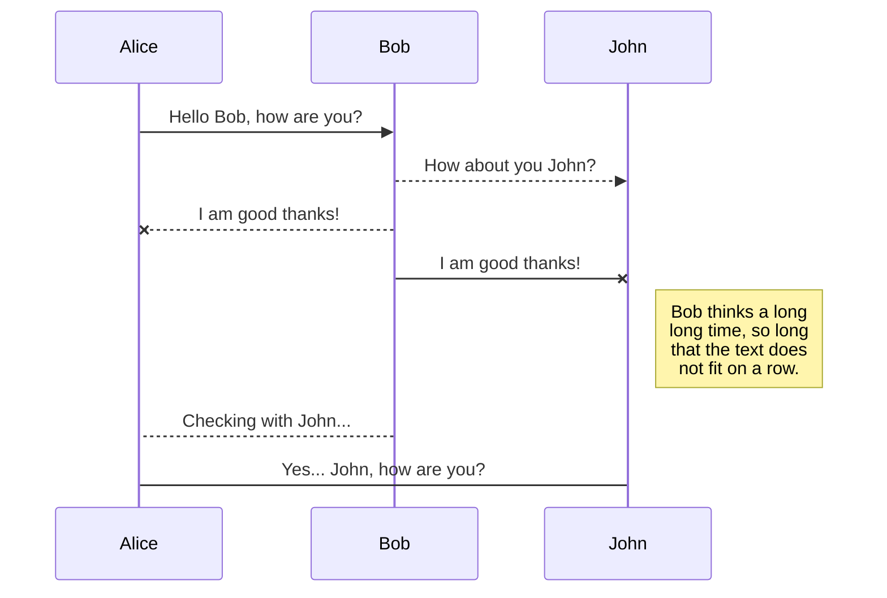
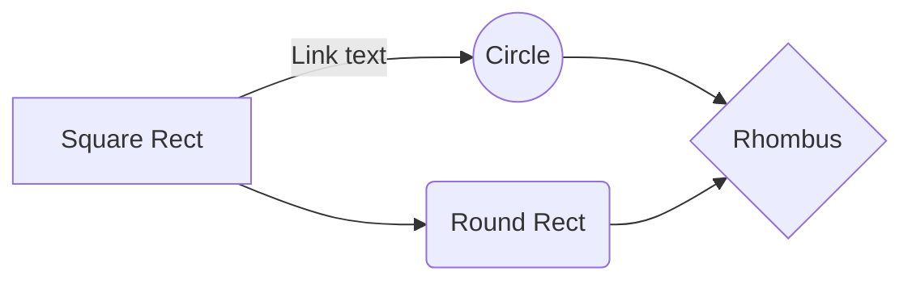

# Simple Video Game Management System API

## Tech stack

 - PHP 8.1
 - Composer 2.6
 - Laravel 10.48
 - MySQL 8
 - docker

## Supported Functionalities

 - Authentication with Laravel Sanctum
 - User Registration, Log in, Log out
 - Two User roles: Admin and Regular User
 - Users can add, edit, delete and view a game record
 - Users can see a list of their games, sort them by Release Date and filter them by Genre
 - Users don't have access to other users' records
 - Data validation during user registration, user login, game creation or update.
 - Admin can delete other users' games and make another user an Admin.

## Run on PC

In project's directory, run

    php artisan serve

 The API starts on http://127.0.0.1:8000

 With the MySQL database running on port 3306
To create the database schema, run

    php artisan migrate
To populate the database, run

    php artisan db:seed
Admin user: username = john57, password = password
Regular user: username = jane68, password = secret

## Run API on docker

**For database running on PC host:**

First open the .env file in the project directory
and change DB_HOST property to

    DB_HOST=host.docker.internal
Then open a terminal in the project's directory and run

    docker build -t demo/laravel:0.1 .
and then

    docker run -p 8000:80 demo/laravel:0.1

**For database  running on docker:**

## POST Requests

You can rename the current file by clicking the file name in the navigation bar or by clicking the **Rename** button in the file explorer.

## GET Requests

You can delete the current file by clicking the **Remove** button in the file explorer. The file will be moved into the **Trash** folder and automatically deleted after 7 days of inactivity.

## UPDATE (PUT/PATCH) Requests

You can export the current file by clicking **Export to disk** in the menu. You can choose to export the file as plain Markdown, as HTML using a Handlebars template or as a PDF.

## DELETE Requests

You can export the current file by clicking **Export to disk** in the menu. You can choose to export the file as plain Markdown, as HTML using a Handlebars template or as a PDF.

## API Endpoints

|Functionality    |API Endpoint                 |
|-----------------|-----------------------------|
|Single backticks |'Isn't this fun?'            |
|Quotes           |"Isn't this fun?"            |
|Dashes           |-- is en-dash, --- is em-dash|

## UML diagrams

You can render UML diagrams using [Mermaid](https://mermaidjs.github.io/). For example, this will produce a sequence diagram:

And this will produce a flow chart:

